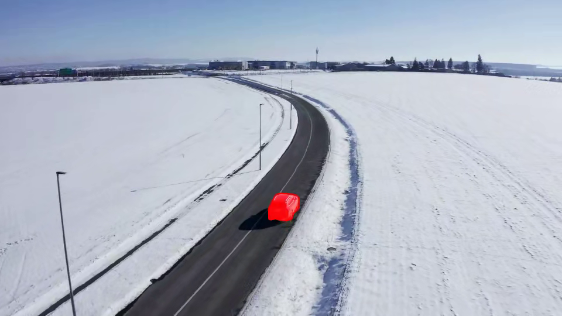
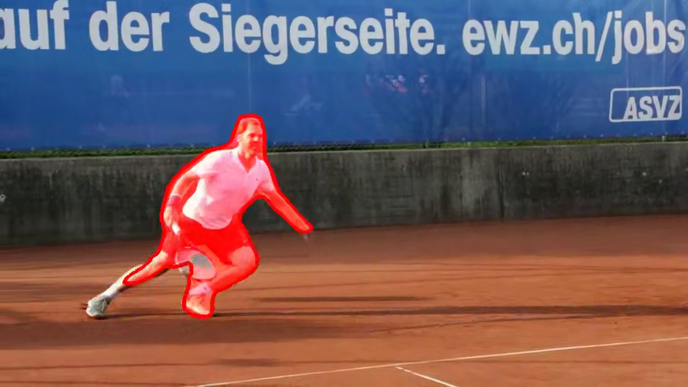

# SiamMask ONNX Demo

**[Code source for this blog post](https://vjraj.dev/blog/siammask_onnx_export)**

    
    

    <a href="./assets/car_example.mp4" style="margin-right: 265px">Video</a>
    <a href="./assets/tennis_example.mp4">Video</a>

## Changelogs

* September 17 2023 - Initial release of SiamMask + Refinement module trained on VOT18 [(release v1.0.0)](https://github.com/vjsrinivas/siammask_onnx/releases/download/v1.0.0/siammask_resnet50_refine_vot18_ort.onnx)

## Usage

There are three main files that help export the official SiamMask repoistory to ONNX and visualize it via a video or webcam. Before running these files, make sure you have all the prerequisites for the [official SiamMask git repo](https://github.com/foolwood/SiamMask). Afterwards, install this project's requirement: `pip install requirements.txt`

### export.py

Place this file into the official SiamMask git repo. Run the following command to start the export process: `python export.py`. You will see two onnx files (`<FILE>.onnx` and `<FILE>_simp.onnx`).

### main.py

Demo that accesses a user's webcamera and running the model on a user-defined ROI.

Select an ROI by clicking and dragging a box around a certain box. If you want to redo an ROI, press "c" or "ESC" to clear the ROI. To run the model on the ROI, press "Enter". To stop and reset the ROI, press "c" or "ESC".

| Argument | Default Value | Description |
|---|---|---|
| --model |  | The path to the saved ONNX model |
| --cam_id | 0 (optional) | The camera ID that is fed into OpenCV2's VideoCapture. Defaults to 0, which is the first webcam connected to the computer |

### main_video.py

Demo that runs a predefined ROI on a video file. Outputs an annotated version of that video.

| Argument | Default Value | Description |
|---|---|---|
| --model |  | The path to the saved ONNX model |
| --video | "tennis.mp4" (optional) | The path to the video being processed |
| --output | None (optional) | An optional argument that lets users save an annotated video to the specified path. Currently restricted to outputting as ".mp4" videos |
| --profile | False (store_true) | An optional argument that records the average inference and end2end speed of the model. **Requires CuPy for CUDA events.** Statistics will be displayed in console after processing is completed |
